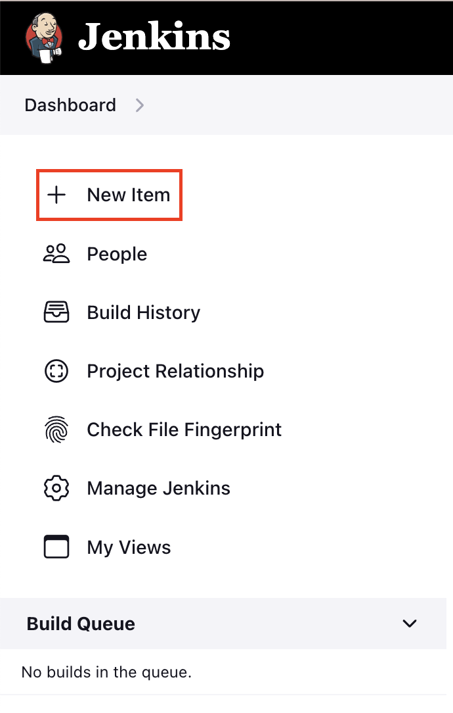

# jenkins-integration

To trigger automagically from your GitHub repo inside Jenkins, you need to:

1. Create API key
2. Create Test Target
3. Add a WebHook to your GitHub Repository
4. Extend your Jenkinsfile with the [script in this repo](Jenkinsfile)

## Creating API key
You can get your API key from the [octomind landing page](https://app.octomind.dev) once signed-in.
If you are greeted with the 'Setup your autonomous end-to-end tests' message, please sign-in first

Click on `Create an API key`.

You then will be navigated to our auth provider where you can create a new org-level API key.

You can only copy the API key once, so make sure to do that now. You should not share it with anyone.

Please add the API key to your CI provider as a secret.

## Creating Test Target

You can get your test target ID from the [octomind landing page](https://app.octomind.dev) once signed-in.
If you are greeted with the 'Setup your autonomous end-to-end tests' message, please sign-in first

## Adding webhook

1. Select your repository `Settings`, go to `Webhooks` and click `Add webhook.`
___

2. For the  URL set `<your-jenkins-url>/github-webhook/` and select `application/json` for Content type.
Also select triggers that best suite your need. 
In general, `the push event` is enough, but for this example, we also want to trigger automagically on `Pull Request`.
___

Check `Pull requesuts` and `Pushes`, after that click on `Add webhook`.
___

3. If everything is ok, you should see a green checkmark after a few moments.
___

## Jenkins

You should copy Jenkinsfile [script in this repo](Jenkinsfile) to the desired step in your pipeline.

You should add your `AUTOMAGICALLY_TOKEN` to your secrets. Navigate to `Dashboard -> Manage jenkins -> Credentials -> System -> Global credentials (unrestricted)` and click on `Add Credentials`.
For the `Kind` you need to select `Secret text`. Be careful that your `ID` matches the `ID` that you call within the Jenkinsfile script. Copy your Token value to the `Secret` field and click `Create`.
___

If you want, you can enable safe parsing of HTML so you can click the link to the test report the pipeline output for you.
Navigate to `Dashboard -> Manage jenkins -> Security` and for `Markup Formatter` select `Safe HTML` and then save.
___

## Creating Jenkins Pipeline

If you're new to Jenkins, this is how you can create a pipeline to test the script

1. On your Dashboard page, click on `+ New Item`
___

2. Give your Project a name, select Pipeline and press OK
___

3. You can check `GitHub project` and paste an url to your repo so you will have a button on your dashboard to take you to your repo.
You need to check `GitHub hook trigger for GITScm polling` so our previously created hook can trigger our pipeline.
___

4. For the `Definition`, you should select `Pipeline script from SCM`.
For `SCM` you should select `Git`
After adding your `Repository URL`, you also need to provide credentials if it is Private repository.
___

You also need to specify a branch, in this example `*/*` will trigger the pipeline on pushing to any branch.
If you want to trigger pipeline only on specific branch changes, e.g. main, you should put `*/main`.
The last field asks you to set the path and name to Jenkinsfile, but in our repository, it is on top level, and it is named Jenkinsfile, so no changes required.
Lastly, click on save
___

